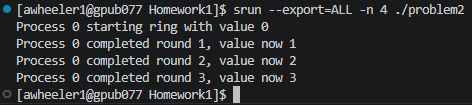

# Homework 2

This directory contains the code for the second homework problem set. The due
date for this assignment is April 13, 2026 at 11:59 p.m. CDT.

Each problem of the assignment has the corresponding question at the top of the
source code file. No additional headers are used by the problems, and each one
is contained in a single source file.

## Compiling

In order to make compiling easier, the `cmake` utility is used. This allows for
automatic handling of Kokkos and MPI dependencies without requiring additional
steps. A build script ([build.sh](./build.sh)) is included that automatically
compiles every source code file into a corresponding executable. The output
binaries are placed in the [build](./build) directory.

## Running

All output binaries are found in the [build](./build) directory, and they can be
ran from there. Problems 1 and 8 require the use of `mpirun`, while the others
utilize Kokkos.

[Problem 8](./problem8.c) specifically requires the additional value for the
`-np` argument to be 3. Other values may cause problems.

## Running Ring on Delta

Below is screenshot of the ring program running on Delta.



## Example Compiling and Running
For more information on how each binary is compiled and which parallel libraries
are used, see the include [CMakeLists.txt](./CMakeLists.txt) file.

```sh
./build.sh
mpirun -np 3 problem8.c
```
